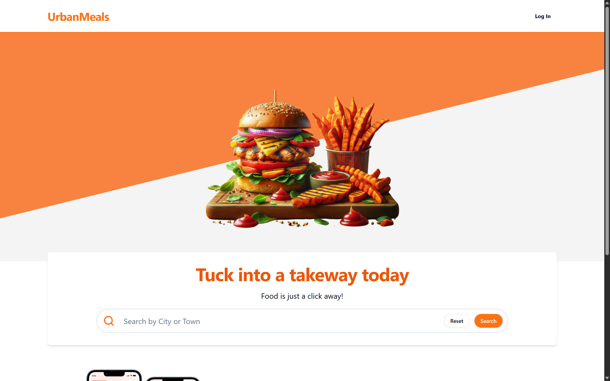
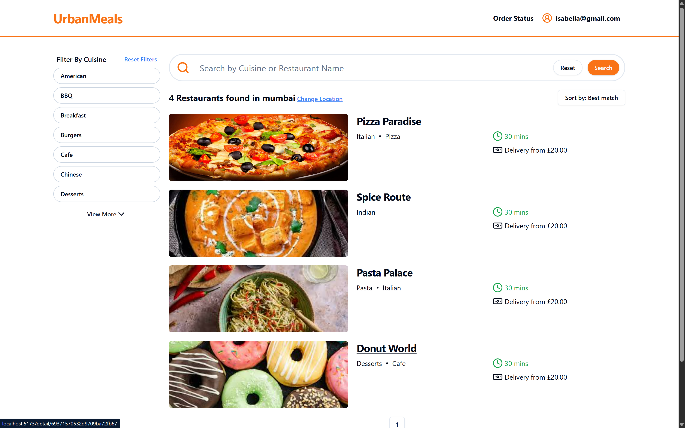
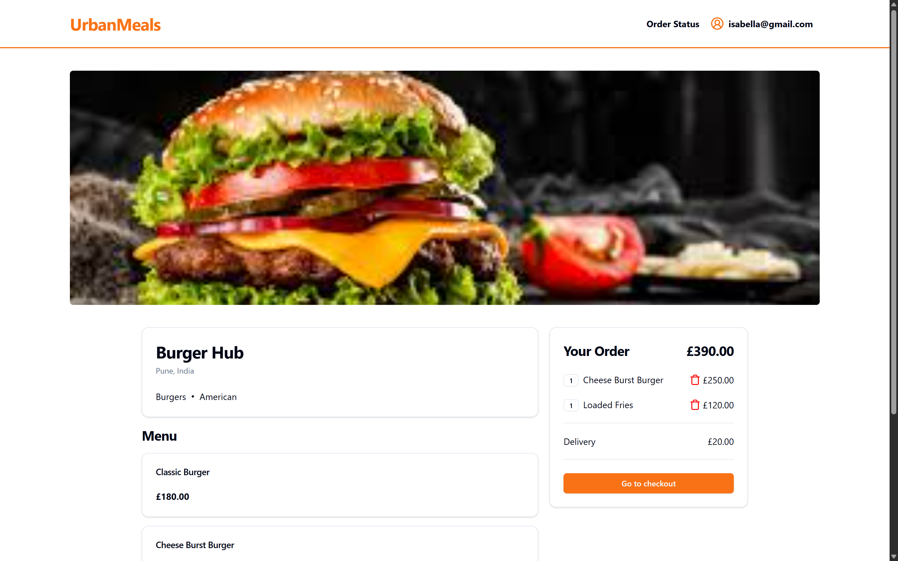
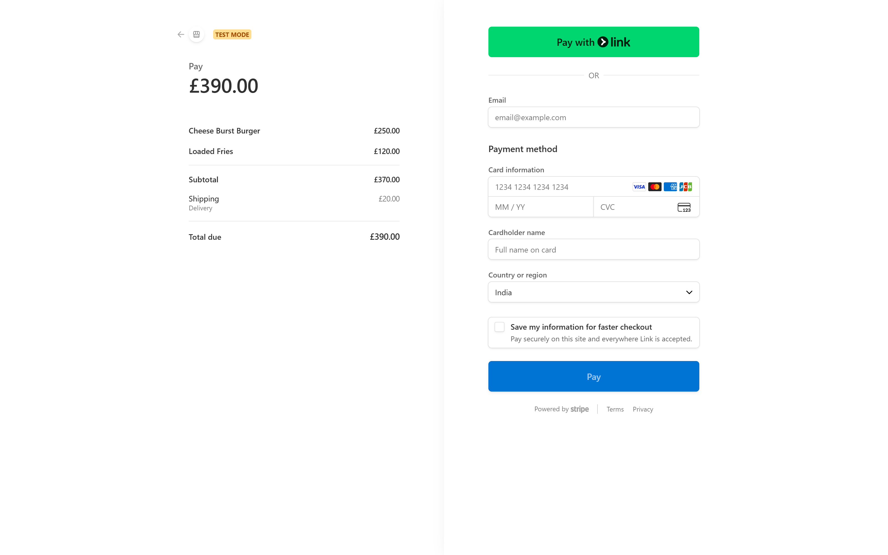
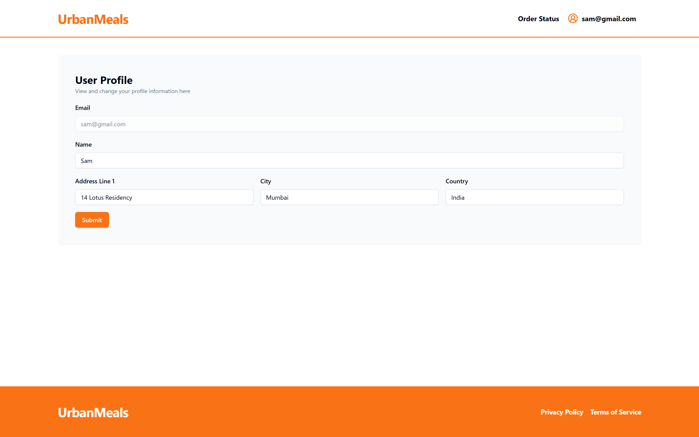
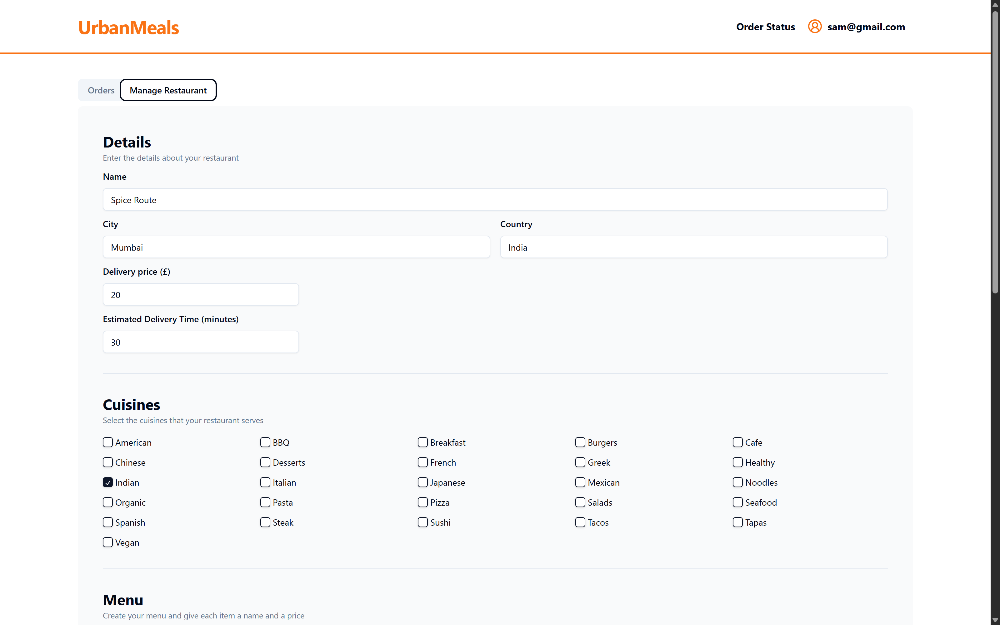
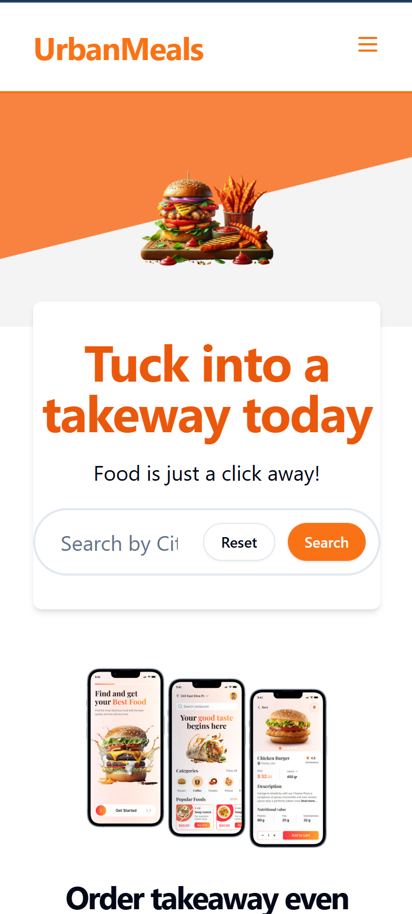
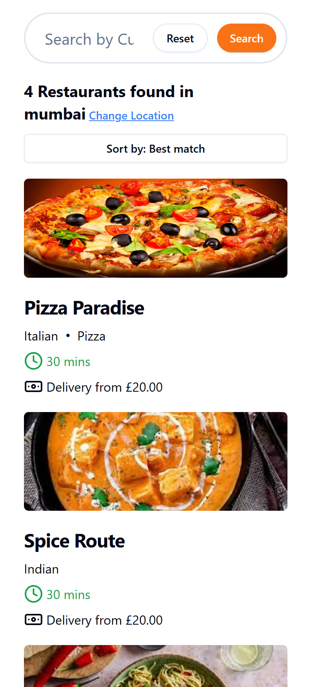

# 🍔 UrbanMeals - Food Ordering Application (Frontend)

A modern, responsive food ordering web application built with React, TypeScript, and Vite. UrbanMeals allows users to search for restaurants, browse menus, place orders, and track delivery status in real-time.


---

## 📖 Table of Contents

- [Features](#-features)
- [Tech Stack](#-tech-stack)
- [Screenshots](#-screenshots)
- [Getting Started](#-getting-started)
- [Environment Variables](#-environment-variables)
- [Project Structure](#-project-structure)
- [API Integration](#-api-integration)
- [Available Scripts](#-available-scripts)
- [Contributing](#-contributing)
- [License](#-license)

---

## ✨ Features

### For Customers
- 🔍 **Search Restaurants** - Search for restaurants by city or town
- 🍕 **Browse Menus** - View restaurant details and browse menu items
- 🛒 **Shopping Cart** - Add/remove items with persistent cart storage
- 💳 **Secure Checkout** - Integrated payment processing with Stripe
- 📦 **Order Tracking** - Real-time order status updates (Placed → Paid → In Progress → Out for Delivery → Delivered)
- 👤 **User Profiles** - Manage delivery addresses and personal information

### For Restaurant Owners
- 🏪 **Restaurant Management** - Create and manage your restaurant profile
- 📋 **Menu Management** - Add, edit, and remove menu items
- 📊 **Order Dashboard** - View and manage incoming orders
- 🖼️ **Image Upload** - Upload restaurant and menu item images

### General
- 🔐 **Auth0 Authentication** - Secure login/signup with Auth0
- 📱 **Responsive Design** - Works seamlessly on desktop and mobile
- 🎨 **Modern UI** - Beautiful interface with shadcn/ui components
- ⚡ **Fast Performance** - Optimized with Vite and React Query caching

---

## 🛠️ Tech Stack

| Category | Technology |
|----------|------------|
| **Framework** | React 18 |
| **Language** | TypeScript |
| **Build Tool** | Vite |
| **Styling** | TailwindCSS |
| **UI Components** | shadcn/ui (Radix UI) |
| **Routing** | React Router DOM v6 |
| **State Management** | React Query |
| **Form Handling** | React Hook Form + Zod |
| **Authentication** | Auth0 |
| **Icons** | Lucide React |
| **Notifications** | Sonner |
| **Theming** | next-themes |

---

## 📸 Screenshots

### Home Page
The landing page featuring the search bar and app download section.



---

### Search Results Page
Restaurant search results with cuisine filters and sorting options.



---

### Restaurant Detail Page
Individual restaurant view with menu items and order summary.



---

### Shopping Cart
Order summary with delivery details form.


---

### Checkout Page
Checkout page with payment options.


---

### Order Status Page
Real-time order tracking with progress indicator.


---

### User Profile Page
User profile management with delivery address settings.



---

### Restaurant Management Dashboard
Restaurant owner dashboard with orders and restaurant settings tabs.




---

### Mobile Responsive Views
Mobile navigation and responsive layouts.

<div align="center">
  
  
</div>

---

## 🚀 Getting Started

### Prerequisites

- Node.js 18+ 
- npm or yarn
- An Auth0 account for authentication
- Backend API running (see [backend repository](https://github.com/your-username/mern-food-ordering-app-backend))

### Installation

1. **Clone the repository**
   ```bash
   git clone https://github.com/your-username/mern-food-ordering-app-frontend.git
   cd mern-food-ordering-app-frontend
   ```

2. **Install dependencies**
   ```bash
   npm install
   ```

3. **Set up environment variables**
   ```bash
   cp .env.example .env
   ```
   Edit `.env` and fill in your configuration values (see [Environment Variables](#-environment-variables))

4. **Start the development server**
   ```bash
   npm run dev
   ```

5. **Open in browser**
   
   Navigate to `http://localhost:5173`

---

## 🔐 Environment Variables

Create a `.env` file in the root directory with the following variables:

```env
# Backend API URL
VITE_API_BASE_URL=http://localhost:7000

# Auth0 Configuration
VITE_AUTH0_DOMAIN=your-tenant.us.auth0.com
VITE_AUTH0_CLIENT_ID=your-auth0-client-id
VITE_AUTH0_CALLBACK_URL=http://localhost:5173
VITE_AUTH0_AUDIENCE=your-auth0-api-audience
```

### Getting Auth0 Credentials

1. Sign up at [Auth0](https://auth0.com/)
2. Create a new application (Single Page Application)
3. Configure callback URLs to include `http://localhost:5173`
4. Copy the Domain and Client ID to your `.env` file
5. Create an API and copy the Audience identifier

---

## 📁 Project Structure

```
mern-food-ordering-app-frontend/
├── public/                     # Static assets
├── src/
│   ├── api/                    # API integration hooks
│   │   ├── MyRestaurantApi.tsx # Restaurant owner API calls
│   │   ├── MyUserApi.tsx       # User profile API calls
│   │   ├── OrderApi.tsx        # Order management API calls
│   │   └── RestaurantApi.tsx   # Restaurant search API calls
│   ├── assets/                 # Images and static assets
│   ├── auth/                   # Authentication components
│   │   ├── Auth0ProviderWithNavigate.tsx
│   │   └── ProtectedRoute.tsx
│   ├── components/             # Reusable UI components
│   │   ├── ui/                 # shadcn/ui components
│   │   ├── Header.tsx
│   │   ├── Footer.tsx
│   │   ├── SearchBar.tsx
│   │   ├── CuisineFilter.tsx
│   │   └── ...
│   ├── config/                 # App configuration
│   ├── forms/                  # Form components
│   │   ├── manage-restaurant-form/
│   │   └── user-profile-form/
│   ├── layouts/                # Page layouts
│   ├── lib/                    # Utility functions
│   ├── pages/                  # Page components
│   │   ├── HomePage.tsx
│   │   ├── SearchPage.tsx
│   │   ├── DetailPage.tsx
│   │   ├── UserProfilePage.tsx
│   │   ├── ManageRestaurantPage.tsx
│   │   ├── OrderStatusPage.tsx
│   │   └── AuthCallbackPage.tsx
│   ├── AppRoutes.tsx           # Application routing
│   ├── main.tsx                # Application entry point
│   ├── types.ts                # TypeScript type definitions
│   └── global.css              # Global styles
├── .env.example                # Environment variables template
├── index.html                  # HTML entry point
├── package.json
├── tailwind.config.js          # TailwindCSS configuration
├── tsconfig.json               # TypeScript configuration
└── vite.config.ts              # Vite configuration
```

---

## 🔌 API Integration

The frontend communicates with the backend through the following API modules:

### MyUserApi
- `useCreateMyUser()` - Create a new user profile
- `useUpdateMyUser()` - Update user profile information
- `useGetMyUser()` - Fetch current user profile

### MyRestaurantApi
- `useCreateMyRestaurant()` - Create a new restaurant
- `useGetMyRestaurant()` - Fetch restaurant owner's restaurant
- `useUpdateMyRestaurant()` - Update restaurant details
- `useGetMyRestaurantOrders()` - Fetch incoming orders

### RestaurantApi
- `useSearchRestaurants()` - Search restaurants by city with filters
- `useGetRestaurant()` - Get individual restaurant details

### OrderApi
- `useCreateCheckoutSession()` - Create Stripe checkout session
- `useGetMyOrders()` - Fetch user's order history

---

## 📜 Available Scripts

| Script | Description |
|--------|-------------|
| `npm run dev` | Start development server at `http://localhost:5173` |
| `npm run build` | Build for production (runs TypeScript compiler and Vite build) |
| `npm run lint` | Run ESLint for code quality checks |
| `npm run preview` | Preview production build locally |

---

## 🛣️ Routes

| Path | Component | Description | Protected |
|------|-----------|-------------|-----------|
| `/` | `HomePage` | Landing page with search | No |
| `/search/:city` | `SearchPage` | Restaurant search results | No |
| `/detail/:restaurantId` | `DetailPage` | Restaurant menu and ordering | No |
| `/auth-callback` | `AuthCallbackPage` | Auth0 callback handler | No |
| `/user-profile` | `UserProfilePage` | User profile management | ✅ Yes |
| `/order-status` | `OrderStatusPage` | Order history and tracking | ✅ Yes |
| `/manage-restaurant` | `ManageRestaurantPage` | Restaurant owner dashboard | ✅ Yes |

---

## 🤝 Contributing

Contributions are welcome! Please follow these steps:

1. Fork the repository
2. Create a feature branch (`git checkout -b feature/amazing-feature`)
3. Commit your changes (`git commit -m 'Add amazing feature'`)
4. Push to the branch (`git push origin feature/amazing-feature`)
5. Open a Pull Request

---

## 📄 License

This project is licensed under the MIT License - see the [LICENSE](LICENSE) file for details.

---

## 🙏 Acknowledgements

- [shadcn/ui](https://ui.shadcn.com/) - Beautiful UI components
- [Auth0](https://auth0.com/) - Authentication and authorization
- [Stripe](https://stripe.com/) - Payment processing
- [TailwindCSS](https://tailwindcss.com/) - Utility-first CSS framework
- [Vite](https://vitejs.dev/) - Next generation frontend tooling

---

<div align="center">
  <p>Made with ❤️ for food lovers everywhere</p>
  <p>⭐ Star this repository if you found it helpful!</p>
</div>
